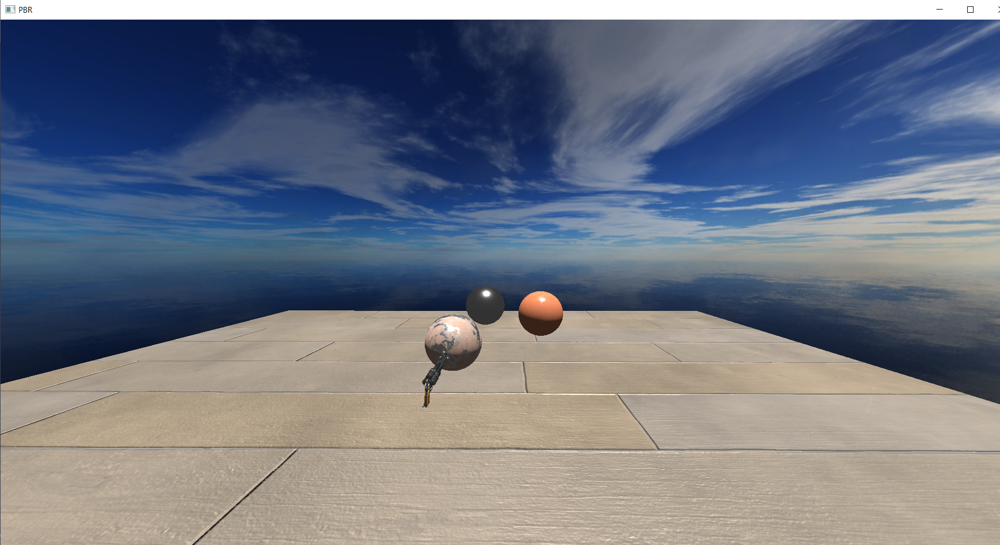

# SimpleRenderEngine
SimpleRenderEngine is a C++ and OpenGL based render engine. Currently it supports only OpenGL API and planning to add support for Vulkan, DirectX12 in future. 

##Screenshots

Screenshots of the PBR rendering output.

PBR Materials from: http://freepbr.com

