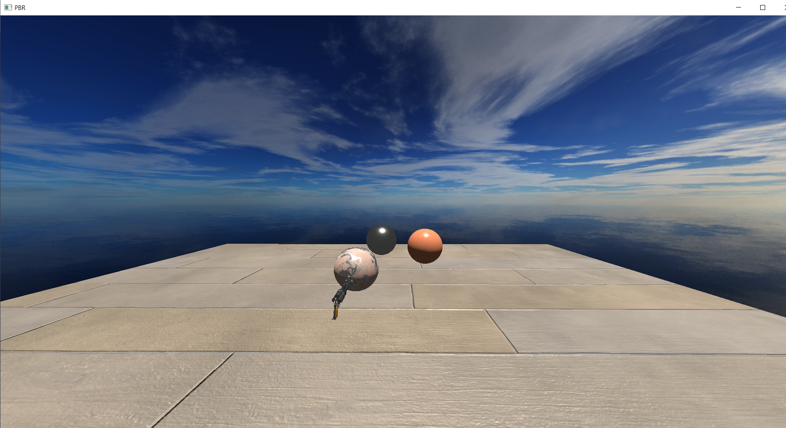
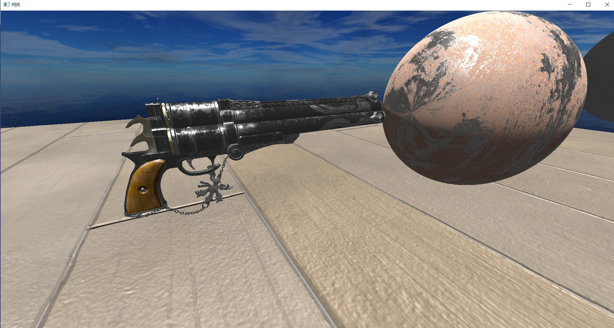
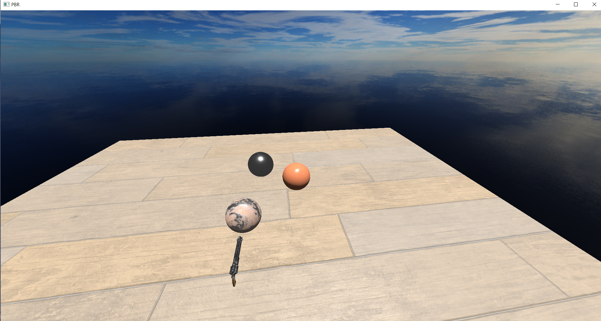

# SimpleRenderEngine
SimpleRenderEngine is Graphics Rendering Engine built with OpenGL and C++. The main foucs of developing this render engine is to implement real time graphics effects such as PBR. Currently it supports only OpenGL API and planning to add support for Vulkan, DirectX12 in future. 

# Implementation 
 The rendering engine is implmented in such a way that it can handle rendering of opaque, transparent, static and dynamic objects with an appropriate order to achieve better FPS. 
 The texture and shader modules are implemented based on cache mechanism to achieve faster fetch. 
 
## Below are the list of features implemented currently:
 1. Forward rendering
 2. PBR
 3. Skybox
 4. Gamma correction
 5. Cook Torrance Specular BRDF

## Todo features
 1. Deffered rendering
 2. FXAA
 3. Bloom Effect
 4. DOF
 5. MSAA
 6. IBL(Light Probes)
 7. SSAO
 8. Shadow Mapping(Cascaded shadow maps, PCF)

## Below are the sources reffered for implmenting PBR shaders
 1. https://learnopengl.com/PBR/Lighting
 2. https://blog.selfshadow.com/publications/s2013-shading-course/karis/s2013_pbs_epic_notes_v2.pdf

## Screenshots

Screenshots of the PBR rendering output.

PBR Materials from: http://freepbr.com  and Cube maps from: http://www.humus.name/index.php?page=Textures 
and: http://www.custommapmakers.org/skyboxes.php

